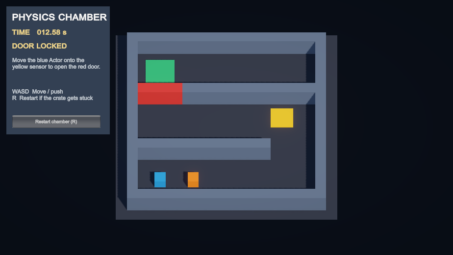

# Physics Chamber — Coding Assignment #1

A Unity physics maze: move the blue Actor with WASD, activate the yellow sensor,
and push the orange Payload through the unlocked red door into the green DepositZone.

**Student work remaining:** write the four reflection answers below in your own
words, review/play the project, and submit this repository link through the course portal.
The reflection sections are blank for you to complete.

## Open and play

1. Clone/download this repository and add its root folder in Unity Hub.
2. Open with **Unity 6000.3.24f1** (Universal 3D / URP).
3. Open `Assets/Scenes/Chamber.unity` and press Play.
4. Click the Game view. Use **WASD** to move/push and **R** (or the HUD button) to restart.
5. Use a **16:9** Game view to see the board and status panel comfortably.

The scene is included as the first scene in Build Settings. Dependencies are
recorded in `Packages/manifest.json` and `Packages/packages-lock.json`.

## Route and rules

- Start in the bottom-left corridor. Push the crate right, then get behind it
  to push north through the first gap.
- Step the **Actor** onto the yellow sensor in the middle-right corridor.
  The sensor turns green, the red door disappears with its collider, and the
  Console logs `Roadblock removed`.
- Get to the right of the crate and push it left through the middle corridor.
  Then get behind it and push north through the open doorway into the green zone.
- Only the designated Rigidbody tagged **Payload** can complete the level.
  The Actor and other objects do not count.
- The door must have been unlocked and physically removed before deposit.
  An early entry is rejected; a Payload already inside must leave and enter again
  after unlock. Simply unlocking while it remains inside does not win.
- Success logs elapsed scene time from Play/restart, fires one success event,
  freezes the displayed result, and stops further movement input.
- Time is Unity's scaled gameplay clock. Editor pauses do not count. Normal gameplay
  uses time scale 1.
- The crate can become trapped against an outside wall. R restores all starting
  positions, the locked door, sensor color, and timer.

## Scripts

| Script | Responsibility |
| --- | --- |
| `ActorMovement.cs` | Reads keyboard state in `Update`; applies normalized movement force in `FixedUpdate`. |
| `ChamberRun.cs` | Owns unlock/success state, removes the roadblock, validates deposits, logs time, and restarts the scene. |
| `UnlockSensor.cs` | Accepts only the Actor's Rigidbody and Player tag; requests unlock and changes sensor color. |
| `DepositZone.cs` | Reports trigger entries to the run controller. |
| `ChamberHUD.cs` | Shows controls, objective, door state, timer, and restart button. |
| `Editor/ChamberSetup.cs` | Editor utility that wires/tunes the existing maze; not used by the running game. |

## Physics settings and experiment data

| Setting | Actor | Payload |
| --- | ---: | ---: |
| Mass | 1 | 1 |
| Linear damping | 4 | 0.5 |
| Angular damping | 0.05 | 0.05 |
| Frozen rotations | X, Y, Z | X, Z |

Movement uses **20 N** with `ForceMode.Force`. Actor, Payload, and floor use
`ChamberContact`: static friction **0.15**, dynamic friction **0.12**, zero bounce,
and Minimum friction/bounce combine. The wall colliders remain solid. The sensor
and DepositZone colliders are triggers.

Automated measurements and their method are in [Validation](Validation/README.md).
These are automated test measurements. Use your own playtesting and observations
for the reflections.

To repeat a mass experiment manually, stop Play, set Payload Mass to 0.5, 1, or 3,
then restart and compare the same straight push while keeping other settings fixed.
Restore Mass to 1 afterwards. Record your own observations without changing several
settings at once.

## Validation

Play Mode tests are in `Assets/Tests/PlayMode/ChamberPlayModeTests.cs`. Run them from
**Window → General → Test Runner → PlayMode**. They load the actual scene, use
Rigidbody physics and trigger callbacks, and include an end-to-end push through
both maze turns. Test-only placement is used for isolated rejection/reset cases;
the full-route test never teleports the Payload.

## Student reflections — write 3–6 sentences each

### 1. Success conditions and a possible cheat

The Actor must activate the sensor to remove the roadblock, then push the Payload into the DepositZone. The scripts check the Payload’s tag and Rigidbody, the unlocked state, and whether success has already occurred. Depositing early cannot bypass the sensor because the Payload must enter again after unlocking.

### 2. An unexpected behavior

The Payload initially moved after a collision but stopped during continuous pushing. The exact cause was not isolated, but the behavior involved the balance between applied force, friction, and damping. The final setup uses lower contact friction and different damping values, and continuous-pushing tests passed.

### 3. A design decision and tradeoff

The Actor uses linear damping of 4, while the Payload uses 0.5. This favors precise Actor positioning while allowing the Payload to retain momentum. The tradeoff is that the Payload can continue sliding when the player wants it to stop.

### 4. The weakest part

A weakness is that the Payload can become trapped against a wall because the Actor can only push it. Restarting solves this but removes all progress from the run. A short-range pulling mechanic would help players recover from positioning mistakes.
